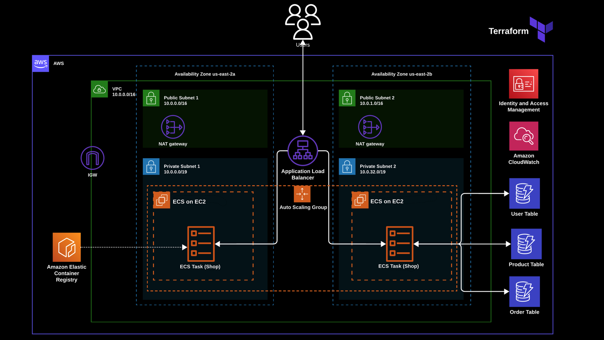

# AWS ECS on EC2 Terraform Deployment

[](https://www.terraform.io/)
[](https://aws.amazon.com/)

## Overview

This repository contains Infrastructure as Code (IaC) using Terraform to deploy a containerized application (Node.JS) on AWS Elastic Container Service (ECS) with EC2 launch type. The infrastructure is designed with high availability, scalability, and security best practices in mind.

## Architecture Diagram



The infrastructure includes the following:

- **Networking Layer**:
  - VPC with CIDR `10.0.0.0/16`
  - 2 Public Subnets across different AZs
  - 2 Private Subnets across different AZs
  - NAT Gateways for private subnet internet access
  - Internet Gateway for public subnet access

- **Compute Layer**:
  - ECS Cluster with EC2 launch type
  - Auto Scaling Group for EC2 instances
  - Application Load Balancer for traffic distribution
  - ECS Tasks running containerized applications

- **Data Layer**:
  - DynamoDB Tables for User, Product, and Order management

- **Monitoring, Security & Others**:
  - Amazon CloudWatch for monitoring and logging
  - IAM roles and policies for secure access management
  - Security Groups for network access control
  - ECR Repository that contains the docker image

## Prerequisites

- AWS Account with administrative access or required permission
- [Terraform](https://www.terraform.io/downloads.html) (>= 1.0.0)
- [AWS CLI](https://aws.amazon.com/cli/) configured with appropriate credentials
- [Docker](https://www.docker.com/get-started) for container image building

## Quick Start Guide 


1. Clone the repository:
```bash
git clone https://github.com/sagar-uprety/ecs-on-ec2-terraform.git
cd ecs-on-ec2-terraform
```
2. You need an S3 bucket as a backend for Terraform state. Create one if you have not already and update the  backend configuration in `versions.tf`:
```bash
  ...
  backend "s3" {
    bucket  = "dev-terraform-state-bucket" # update the bucket name here
    region  = "us-east-2"
    encrypt = true
    key     = "main/terraform.tfstate"
  }
  ...
```

3. Initialize Terraform:
```bash
terraform init
```

4. Configure your deployment:
```bash
# Edit dev.tfvars with your configuration
```

5. Review the deployment plan:
```bash
terraform plan --var-file="dev.tfvars"
```

6. Apply the infrastructure:
```bash
terraform apply --var-file="dev.tfvars"
```

7. Cleanup the infrastructure (Caution: If you do not destroy the resources, cost might incure):
```bash
terraform destroy --var-file="dev.tfvars"
```

## Project Structure

```
.
├── README.md
├── main.tf                 # Main Terraform configuration
├── variables.tf           # Input variables declaration
├── outputs.tf            # Output values configuration
├── providers.tf          # Provider configuration
├── versions.tf           # Terraform version constraints and backend configuration 
├── dev.tfvars          # Development environment variables
└── .gitignore         # Git ignore rules
```

## Project Structure

* **`main.tf`**: Defines the core infrastructure for ecs_cluster, ecs_service, and supporting resources
* **`variables.tf`**: Input variables for parameterization and sensitive data
* **`provider.tf`**: Specifies the AWS provider
* **`output.tf`**: Defines outputs for the tf configs
* **`dev.tfvars`**: Variables specific to the dev environment
* **`versions.tf`**: Terraform version constraints and backend configuration 
* **`locals.tf`**: local value to be used in main.tf
* **`.pre-commit-config.yaml`**: git pre-commit configuration 
* **`.gitignore`**: Lists files to exclude from version control

## Configuration


### Required Variables

| Variable Name | Description | Type | Default |
|--------------|-------------|------|---------|
| `environment` | Environment name | string | `` |
| `application` | Application name | string | `` |
| `owner` | Resource owner | string | `` |
| `region` | AWS region to deploy resources | string | `` |

### Optional Variables

Refer to `variables.tf` for a complete list of optional variables and their default values.

## Security Considerations

- All EC2 instances are deployed in private subnets
- Security groups follow the principle of least privilege
- IAM roles are scoped to minimum required permissions

## Monitoring and Logging

The deployment includes:
- CloudWatch metrics for ECS services and tasks
- Container insights for performance monitoring
- ALB access logs (stored in S3)
- ECS task logs in CloudWatch Logs

## Application Source Repository

The sample e-commerce application (Node.js) with source code and dockerfile can be found [here](https://github.com/sagar-uprety/ecs-shop-app-nodejs-sample)

## Contributing

1. Fork the repository
2. Create your feature branch (`git checkout -b feature/AmazingFeature`)
3. Commit your changes (`git commit -m 'Add some AmazingFeature'`)
4. Push to the branch (`git push origin feature/AmazingFeature`)
5. Open a Pull Request

## License

This project is licensed under the MIT License - see the [LICENSE](LICENSE) file for details.

## Acknowledgments

- [AWS ECS Documentation](https://docs.aws.amazon.com/ecs/)
- [Terraform AWS Provider](https://registry.terraform.io/providers/hashicorp/aws/latest/docs)
- [AWS Well-Architected Framework](https://aws.amazon.com/architecture/well-architected/)